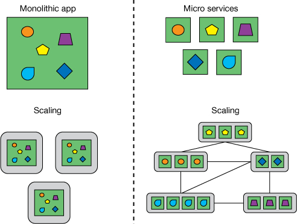

# Mikroservis Nedir?
http://media.sundog-soft.com/es8/install.txt,

## Ölçeklenebilirlik

Mikroservisler, her biri belirli bir işlevselliği yerine getiren küçük, bağımsız hizmetlerdir. Bu, her bir mikroservisin farklı bir kaynağı işlemesi ve ayrı bir ölçeklendirme seviyesine sahip olması anlamına gelir. Böylece, bir mikroservisin artan talebi karşılamak için ölçeklendirilmesi, tüm uygulamanın ölçeklendirilmesine gerek kalmadan gerçekleştirilebilir.

## Bağımsız geliştirme ve Yayınlama

Monolitik mimarilerde modülerlik, programlama dili yapıları ile (örneğin Java'da package) ya da derleme varlıkları ile ifade edilir. Monolitik uygulamalarda modülerliği koruyan bir yapı yoktur. Zaman geçtikce modüller arasındaki bağımlılık artar ve yönetilemez duruma gelir. Mikroservislerde ise modülerlik birimi servislerdir.Contract uygun şekilde bağımsız deploy işlemleri yapabilir

## Hata izolasyonu

Mikroservislerden birinde oluşan hata herhangi bir domino etkisi oluşturmadan sadece ilgili mikroservis etkilenir.Diğer mikroservisler hizmet etmeye devam eder.

## Teknoloji Bağımsızlığı

  Her mikroservisin ihtiyaç duyulan teknoloji ile yazılabilir. Gelişen teknoloji dünyasında uygulamanızın yeni teknolojilere adaptasyonu ve geçişi kolaylaştıracaktır.

## Dezavantajları

* Karmaşıklık artmasına 
* İşletim Maliyetlerinin artmasına 
* Test etkinlik sürelerinin artması 

neden olmaktadır.