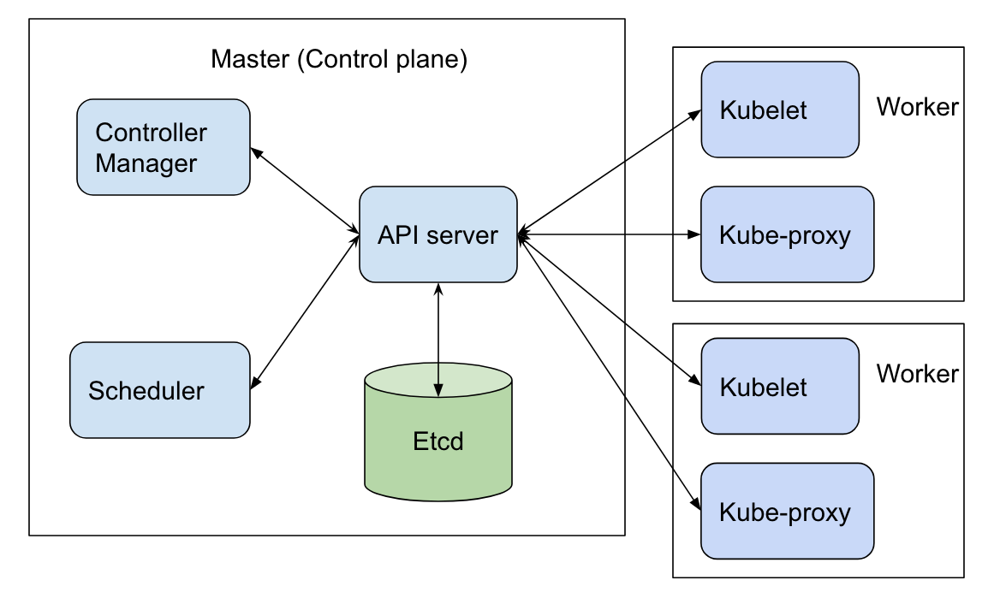

# Mimarisi

Kubernetes mimari olarak 2 parçaya ayrılır. Asıl hizmeti sağlayan işçi nodlar ve bunların yönetildiği ve tutarlılık bilgilerinin saklandığı "Control Plane" dediğimiz yönetim tarafı.

İşçi nodlar, uygulama iş yükünün bileşenleri olan podları barındırır. Kontrol düzlemi, kümedeki çalışan nodları ve içlerindeki podları yönetir. Canlı ortamlarda, kontrol düzlemi genellikle birden çok sunucuda çalışır ve küme genellikle hataya dayanıklılık ve yüksek erişilebilirlik sağlayan birden çok işçi nod çalıştırır.

KubeSpray ile hızlıca kuracağımız bir yapıdır.

Tavsiye edilen şekli:

