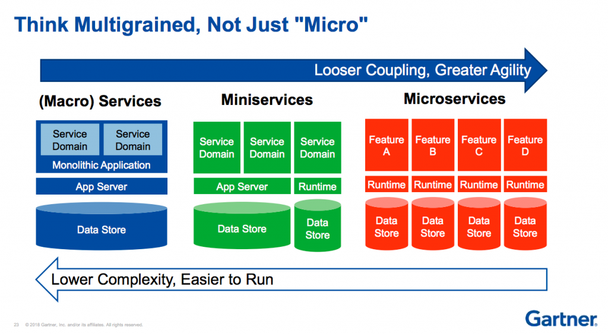

# MiniService

Monolitik uygulamasının bağımsız geliştirme ve ölçeklenebilirlik sorunları ve Mikroservis mimarisinin karmaşıklık sorunlarından ayrılmış mimari bir yaklaşımdır.

* İlgili servisler ortak bir veritabanını kullanır.
* Servisler arası haberleşme REST API ile sağlanır
* Servisler ortak codebase paylaşırlar. Core Consepti ve geliştirildiği için daha hızlı geliştirmeler sağlanır
* Servisleri yatayda genişletebiliyor aynı zamanda mikroservisler arası network trafiği oluşmayacağı için performansı arttırır.
