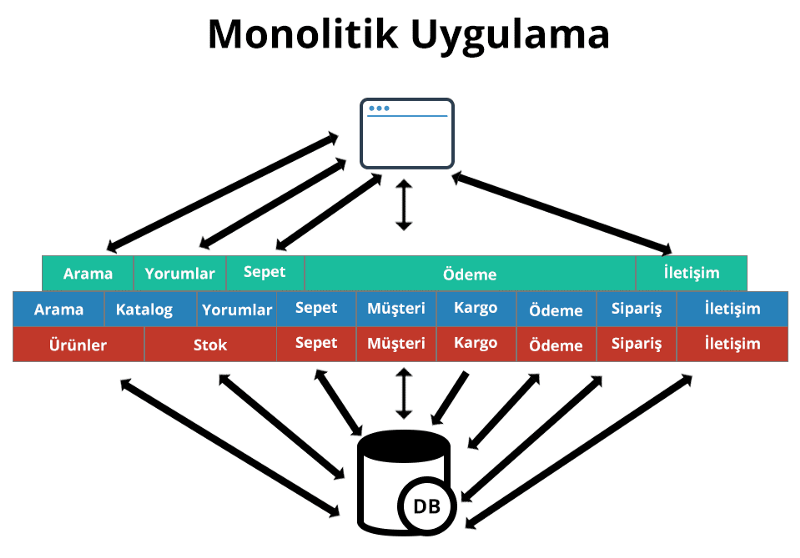

Monolitik uygulamalar, başlangıçta belirlenen teknolojilerle geliştirilen ve proje sonuçlandırılana kadar aynı teknolojilerle sürdürülen, tek bir proje yapısında tasarımı ve gerçekleştirimi yapılan, derleme sonucu tek bir paket oluşan (WAR/EAR) ve oluşan bu paket ile kurulumunun (deploy) yapıldığı uygulamalardır.
 Monolitik mimarilerin, çok küçük boyutlu uygulamalar ya da büyük uygulamaların başlangıcında aşağıdaki faydaları sağlamaktadır:

* Daha basit bir yapı: Monolitik uygulamalar, tüm işlevleri tek bir kod tabanında birleştirdiği için daha basit bir yapıya sahiptir.

* Kolaylıkla yönetilebilir: Tek bir uygulama olduğundan, tüm işlevlerin birbiriyle uyumlu olması daha kolaydır ve uygulamanın yönetimi daha kolay hale gelir.

* Daha hızlı geliştirme: Monolitik uygulamalar, birden çok işlevin bir arada olduğu karmaşık bir yapıya sahip olmadığı için, daha hızlı bir şekilde geliştirilebilir.

* Daha kolay test edilebilir: Tüm işlevler tek bir uygulamada olduğundan, test etmek daha kolaydır ve hata ayıklama süreci daha hızlı hale gelir.

# Sorunları

* Ölçeklenebilirlik sağlayamaması :  Ölçeklenebilirlik artan talep ve kullanım durumlarında verimli ve sorunsuz şekilde genişleme kabiliyetidir.Monolitik uygulamalarda modülerliği koruyan bir yapı yoktur. Zaman geçtikce modüller arasındaki bağımlılık artar ve yönetilemez duruma gelir.Veritabanın tek olması modüllerin tek bir uygulamanın içinde olması yüke uygun olarak modülün yatayda genişletilemiyor.

* Bağımsız Geliştirme ve Yayınlama yapılamıyor. 
* Teknoloji bağımsızlığı sunmuyor
* Hız sorunlarının olması
* Hata izolasyonun olmaması